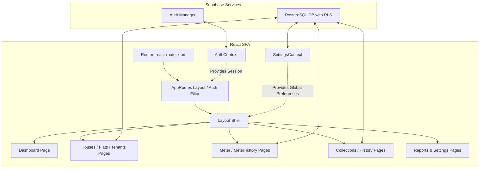
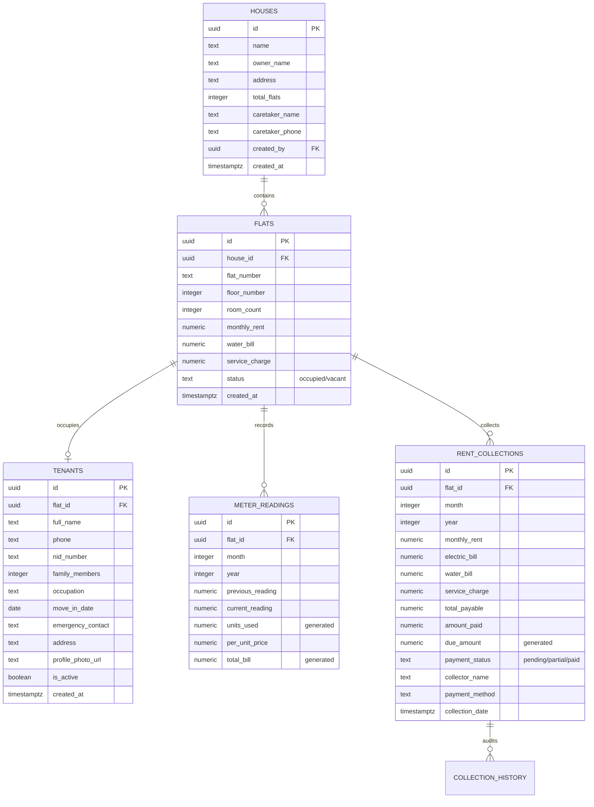

# System Architecture and Design

This document maps out the logical and component-level architecture of **Bari Manager BD (বাড়ি ম্যানেজার BD)**.

## Architecture Overview
The application follows a standard **Serverless Client-Side Single Page Application (SPA)** model. The frontend is built with React, styled using Material UI, and integrated directly with a **Supabase** backend for Authentication, Relational Storage (PostgreSQL), and Row-Level Security (RLS) enforcement.



## Codebase Directory Structure
```
bd rent/
├── .planning/                  # Project roadmap & codebase maps
│   └── codebase/               # Target scan reports (tech, arch, quality, concerns)
├── src/
│   ├── components/             # Reusable global layout component(s)
│   │   └── Layout.tsx          # Main layout shell with sidebar drawer and mobile toolbar
│   ├── contexts/               # React Context Providers for global state
│   │   ├── AuthContext.tsx     # Session state & sign-in/sign-out logic
│   │   └── SettingsContext.tsx # Global settings, data exports, backups, and deletes
│   ├── lib/                    # Library configurations
│   │   └── supabase.ts         # Supabase Client config and TypeScript models
│   ├── pages/                  # Route-level Page views
│   │   ├── Collections.tsx     # Rent collection list and manual payment logs
│   │   ├── Dashboard.tsx       # Statistics summaries and graphical charts
│   │   ├── Flats.tsx           # Flat inventory management
│   │   ├── History.tsx         # Payment logs and ledger audit trail
│   │   ├── Houses.tsx          # House list manager
│   │   ├── Login.tsx           # Email-based administration authentication
│   │   ├── Meter.tsx           # Current month electricity meter input
│   │   ├── MeterHistory.tsx    # Historical log of meter readings
│   │   ├── Reports.tsx         # Graphic data analysis and income reporting
│   │   ├── Settings.tsx        # System configuration panel
│   │   └── Tenants.tsx         # Active and historical tenant profile manager
│   └── supabase/
│       └── migrations/         # PostgreSQL schema structure files
├── index.html                  # HTML entry point
├── vite.config.ts              # Bundler configuration
└── package.json                # Project dependencies
```

## Relational Database Schema
The system maps domain objects directly to relational PostgreSQL tables:



## Core Architectural Flows
1. **User Authentication Flow**:
   - `AuthContext` checks active Supabase JWT session on startup.
   - If unauthenticated, `AppRoutes` intercepts navigation and renders `<Login />`.
   - If authenticated, layout unlocks dashboard routes.
2. **Settings Synchronisation Flow**:
   - On startup, `SettingsContext` loads or inserts a row into `app_settings`.
   - UI views reference the provider values (such as per-unit electricity price, due dates).
   - Local configurations fall back onto `localStorage` keys for multi-lingual default states.
3. **Smart Rent Collection Generation Flow**:
   - Rent collections are recorded per flat with a compound index on `(flat_id, month, year)`.
   - Bill values are composed dynamically based on flat parameters (monthly rent, water, service charge) plus the generated electricity bill from that month's `meter_readings`.
